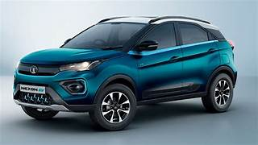
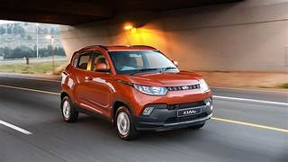

# vehicle-detection-yolov8

## Overview
This project implements a multi-class vehicle detection system using YOLOv8.  
The model is trained on a custom dataset to detect different types of vehicles in real-world scenarios.

### Detected Classes
- Car
- Bus
- Truck
- Bike
- Auto

---

## Tech Stack
- Python
- YOLOv8 (Ultralytics)
- OpenCV
- PyTorch

---

## Dataset
- Custom annotated dataset
- Includes:
  - Multiple vehicles in one frame
  - Different lighting conditions (day/night)
  - Real traffic scenarios

---

## How to Run

### 1. Install dependencies
pip install -r requirements.txt

### 2. Run detection
python detect.py

---

## Results

### Input vs Output

| Input Image | Detected Output |
|------------|----------------|
|  |  |
|  |  |

---

## Project Structure
vehicle-detection-yolov8/
├── test_images/
├── outputs/
├── detect.py
├── data.yaml
├── requirements.txt
├── README.md

---

## Future Improvements
- Improve accuracy with larger dataset
- Real-time vehicle detection
- Vehicle counting system
- Integration with number plate recognition

---

## Author
Raj Sah

---

## Note
Model weights (.pt) and full dataset are not included to keep the repository lightweight.
